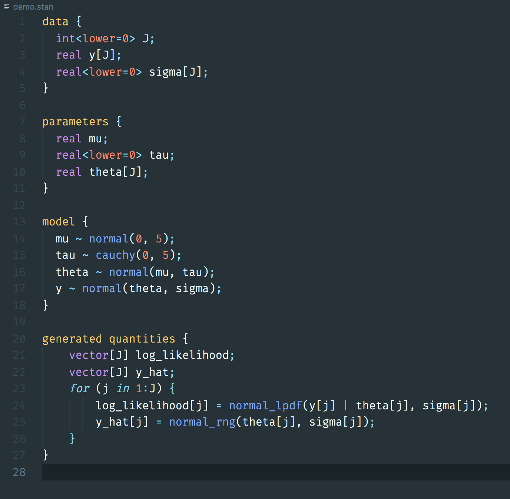
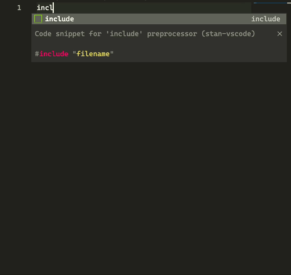
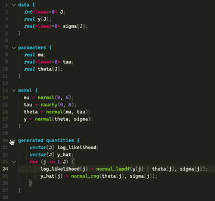

# stan-vscode README

This package adds syntax highlighting, code-folding and snippets for [Stan](https://mc-stan.org) files in [Visual Studio Code](https://code.visualstudio.com/).

The grammar was converted from the [atom-language-stan](https://github.com/jrnold/atom-language-stan) Stan package, but updated to Stan version 2.26.

## Features

### Syntax highlighting


### Snippets


### Code Folding


## Installation

```
code --install-extension ivan-bocharov.stan-vscode
```

or find and install it from the Extensions view.
